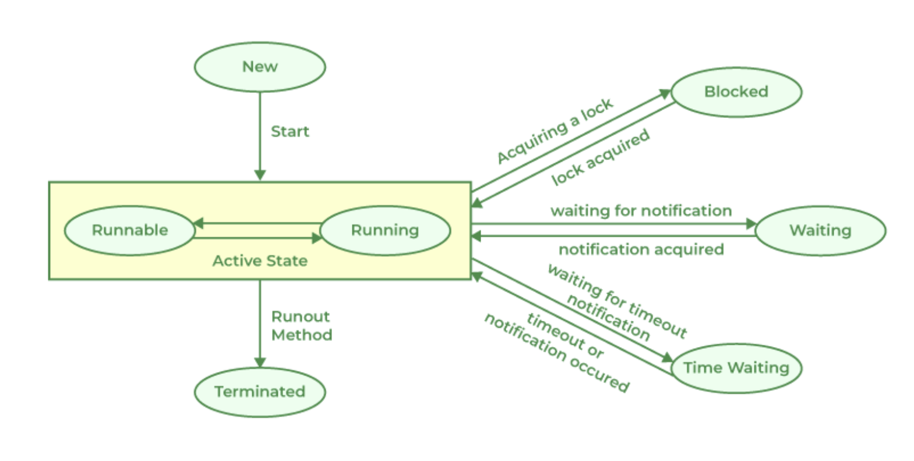

### **`Thread`**

Luồng -> `smallest unit of execution within a program`, run `indipendenetly`.

Bình thường, ta thường dùng `main thread` -> chương trình chỉ có 01 luồng chạy từ đầu tới cuối.

-> **`Multithread`** : instead of `single thread`, we create `two`, `three`, `....` or `more thread` within a program. That called `multithread`.

=> `advantage`: xử lý song song, xen kẽ.

---

### **`Thread Lifecycle`**

1. `new` : mới khởi tạo, chưa `start()`
2. `ready to run`: đã được gọi `start()` và sẵn sàng chạy nếu được cấp tài nguyên.
3. `running` : lệnh của `process` đang được CPU thực hiện.
4. `suspended`: tự nguyện cho phép luồng khác thực hiện.
5. `blocked`: chờ đợi `resource` or `event` nào đó xảy ra.
6. `resumed` : quay trở lại trạng thái sẵn sàng sau khi `suspended/blocked`

```
                  (suspended)
                ______________
                |            |
                v            |        (Sleep, wait, IO)
    New  ---> Ready ----> Running ----> waiting  (blocked)
                           |   ^           |
                           |   |___________|
                           |
                           v
                         dead
```

**`Thread state`**

1. `New` : khởi tạo, chưa `start()`
2. `Runable`: được `start()` và bắt đầu được cấp phát tài nguyên dưới sự kiểm soát của `CPU`
3. `Blocked`: chờ `resource` nào đó / chưa được chọn để chạy
4. `Waiting`: chờ không giới hạn cho tới khi 1 luông khác `wakeup` nó (ex: chờ tài nguyên do luồng khác sd và luồng đó đã sd xong, ....)
5. `Timed Waiting`: chờ 1 khoảng thời gian / 1 luồng khác đánh thức.
6. `Terminated`: `task` hoàn thành / `run()` bị thoát.



---

### **`2 type of Java Thread`**

- `User Thread` / (luồng thông thường).
  - Được tạo bằng cách `extends Thread`/`implements Runnable`.
  - `JVM chờ TẤT CẢ user thread kết thúc mới dừng chương trình`.
- `Deamon Thread` / (luồng chạy nền)
  - Thường dùng cho `auto-save`, `log`, `Garbage Collector`, ...
  - Kết thúc khi tất cả `User thread` kết thúc (=> `JVM kết thúc`) dù đang thực hiện công việc (`runnable`)

**Để thiết lập 1 luồng là `Deamon Thread`**: -> `thread.setDeamon(boolean)` (trước khi `start()`).

**02 ways to create `User Thread`**:
- extends `Thread` class
- implememnts `Runnable` interface
- all `02 ways` above have to `@Override run()` method!.
---

### **`Độ ưu tiên` của `Thread`**

- `Priority` -> độ quan trọng của `Thread` -> khả năng được `CPU` cấp thời gian chạy nhiều hơn.
- Thang đo: `1..10`:
  - `Thread.MIN_PRIORITY` // 1
  - `Thread.NORM_PRIORITY` // 5, default nếu không chỉ đinh
  - `Thread.MAX_PRIORITY` // 10

-> điều chỉnh `priority` using `threadName.setPriority(int)`
