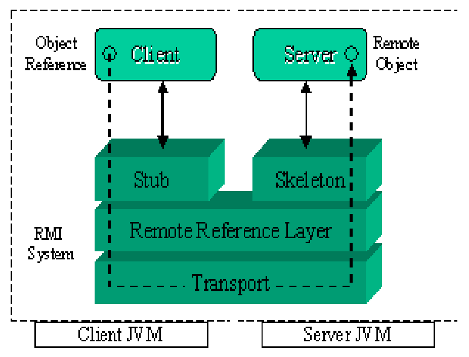
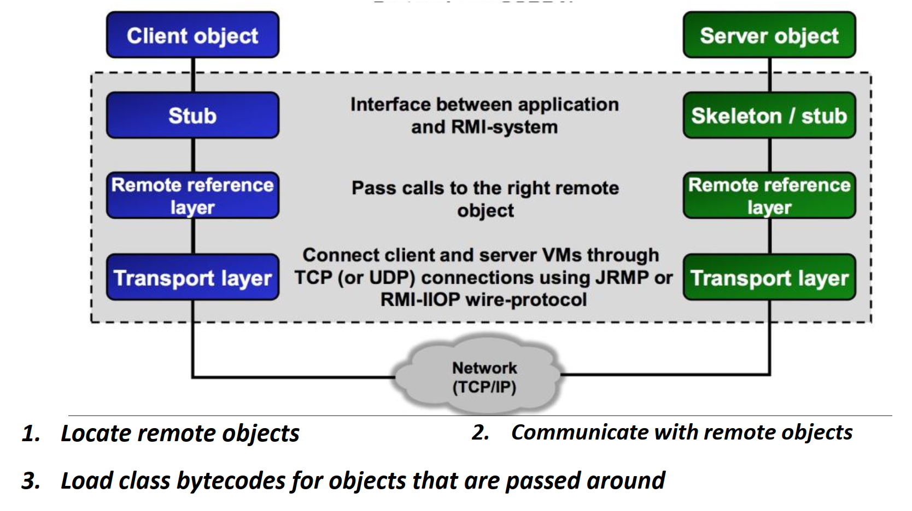

## `RMI` - Remote Method Invocation

**`Cấu trúc RPC`**

- `Server`: cung cấp thủ tục ở xa, cho phép thực thi trên các máy client triệu gọi.
- `Client`: chương trình có thể gọi các thủ tục ở xa trong quá trình tính toán của mình.

```
____________        (Method params)       ____________
|   Client | ---------------------------> |   Server  |
|   JVM    |                              |    JVM    |
| (local   |                              | (remote   |
|  Object) | <--------------------------- |   Object) |
|__________|     (Result / Exception)     |___________|
```

---

**`RMI`**

RMI - Remote Method Invocation: Triệu gọi phương thức từ xa cho phép `1 đối tượng trong Java gọi 1 đối tượng khác nằm trên JVM khác` (_thường là máy khác trong mạng_)

RMI là cách cài đặt cơ chế `RPC - Remote Procedure Call` trong Java cho phép 1 chương trình có thể gọi 1 thủ tục/hàm từ máy khác.

- Là cơ chế truyền thông với kỹ thuật `thuần Java` => _Chỉ các Java Object mới gọi phương thức của nhau từ xa được_
- Tổ chức theo mô hình `Client`/`Server`

_`RMI Architecture`_  
Kiến trúc 1 chương trình client/server theo cơ chế RMI gồm:

|                                                                                                                                                                    |                        |
| :----------------------------------------------------------------------------------------------------------------------------------------------------------------- | :--------------------: |
| - `Stub` : đối tượng trung gian phía `client`<br>- `Skeleton` : đối tượng trung gian phía `server` <br>- `Remote Reference Layer` là lớp tham chiếu từ xa của RMI. |  |



#

_`Stub`, `Skeleton` & `RMIRegistry`_

- `Stub` & `Skeleton`:

  - Trình biên dịch `rmic.exe` - _rmi compiler_ tạo lớp trung gian Stub và Skeleton.
  - `Caller`/`Stub` - _client_ đóng lời gọi và tham số đầu vào (`marshalls`) và truyền đi.
  - `Skeleton` - _server_ thực hiện mở lời gọi (`unmarshalls`) và tìm kiếm method ở Called Object và trả về kết quả. (_**`Hiện nay không còn Skeleton`**_, cơ chế skeleton vẫn còn nhưng được `JVM` làm hết)

- `RMI Registry`:
  - `Server` đăng ký cho đối tượng có thể gọi được từ xa của mình với dịch vụ danh bạ - _registry server_  
     `rmiregistry` là một dịch vụ chạy ngầm, mặc định lắng nghe các yêu cầu ở cổng `1099`
  - `Client` lookup remote object via name that was registered on Registry Server and invoke it.

_**Client/server RMI Application**_

1. `Server` using `Naming` class to register a name for remote object.
2. `Naming` đăng ký `Stub` of remote object with `Register Server`.
3. `Register Server` willing to provide object when meet a ask.
4. `Client` ask `Naming` to lookup remote object via registered name (lookup method).
5. `Naming` ask load `Stub` of remote object to `Client`.
6. Install `Stub` object and return the reference to `Client`.
7. `Client` executes a call to remote method via `Stub` object.

#

**Thành phần chương trình RMI**  
`Remote` Interface

- Định nghĩa các phương thức mà client có thể gọi từ xa.
- Interface này phải extends java.rmi.Remote.
- Các phương thức phải khai báo throws RemoteException.

`Remote` Object (Server Implementation)

- Là class implement interface trên.
- Thường extends UnicastRemoteObject.
- Được đăng ký vào RMI Registry để client tìm thấy.

`RMI Registry`

- Một dịch vụ giống "danh bạ điện thoại" để client lookup remote object theo tên.
- Mặc định chạy ở port 1099.

`Client`

- Lookup object từ RMI Registry.
- Gọi các phương thức từ xa như gọi local method.
