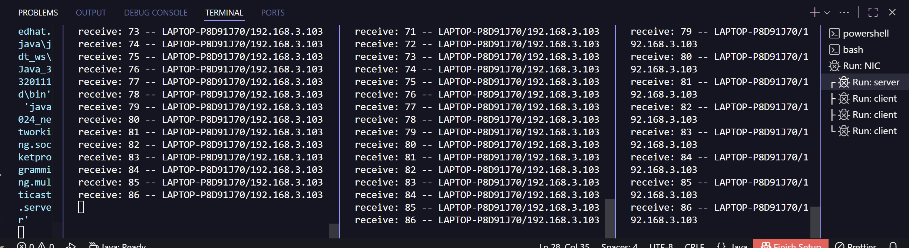

#

`Unicast` - truyền 1-1  
`Broadcast` - truyền tin từ 1 điểm tới tất cả các điểm khác trong `LAN` -> (`tất cả đều phải nhận`)  
`Multicast` - truyền tin từ 1/N điểm tới 1 nhóm điểm khác (`chỉ những ai quan tâm`)

ex: `LAN` có `100 máy`, mục đích: `phát video livestream`:

- `Unicast`: server tạo `100 bản` sao tới `100 tiết bị` -> `băng thông ?`
- `Broadcast`: server `gửi 1 lần`, _`tất cả các thiết bị đều nhận được`_ -> ` máy X không muốn xem thì ?`
- `Multicast`: server `gửi 1 lần` duy nhất tới địa chỉ `IP multicast`, `client` quan tâm thì phải `join group` -> _**chỉ thêm nhánh nếu có ít nhất 1 host trong subnet join multicast group**_.

#

### **`IP Multicast`**

- Một điểm (`sender`) gửi gói tin giống nhau tới nhiều điểm khác (`Receivers`)
  - Chỉ cần gửi gói tin đến một địa chỉ chung của nhóm (`multicast group`)
  - Các điểm trong nhóm có thể nhận được gói tin này
- Ưu điểm:
  - Tối ưu băng thông
  - Giảm độ trễ giữa điểm gửi và nhận

#

_Trong Java, truyền thông `multicast` tương tự như `UDP` nhưng `dùng không gian địa chỉ lớp D` từ **`224.0.0.0`** đến **`239.255.255.255`** làm địa chỉ `IP multicast group`_

### Một số địa chỉ multicast

- `224.0.0.1`: Tất cả các `hệ thống ở trên mạng con cục bộ`
- `224.0.0.2` : Tất cả các `router trên mạng con cục bộ`.
- `224.0.0.11`: Các tác tử di động( `agent`) trên mạng con cục bộ
- `224.0.1.1` : Giao thức `định thời mạng`
- `224.0.1.20`: Thử nghiệm mà không cho vượt ra khỏi mạng con cục bộ
- `224.2.X.X` (Multicast Backbone on the Internet (MBONE)): Được sử dụng cho `audio` và `video` quảng bá trên mạng Internet
- nên dùng: `239.0.0.0 – 239.255.255.255`

#

