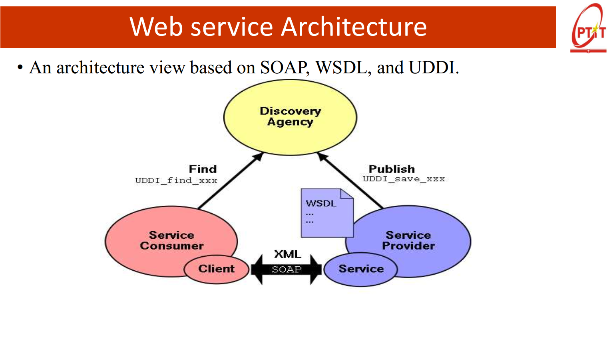

##

`Original Idea`:

- A `Web application` uses Web technologies to provide services to `end user`.
- A Web service uses Web technologies to provide services to `other application`.

=> **Web service = Web + service**

`Advantages`:

- Not based on Programming language/ Platform, based on Web.
- Convergence of SOA (Service-Oriented Architecture) and Web.
- Do not need huge framework of memory.

---

`Web service` is a software application identified by a URI, that is designed to support `machine-to-machine` interact via internet using standard protocol:

- Communicate using `HTTP`
- `XML`/`JSON` based message (Data)



3 major Web services `toolkits` being used widely:

- `.NET Web service`: Developed by Microsoft, using `C#/ VB.NET` programming language. Strongly integrated with Windows, Visual Studio. Supports security, transaction, reliable messaging.
- `Java Web Service - JAX-WS/JAX-RS`: Sun’s Web service implementation for the Java community. Comes bundled in a complete Java Web services Development Pack (JWSDP Ver 1.3) including Tomcat web server.
- `Apache Axis` by IBM (donated to Apache group).One of the earliest and stable Web service implementation. Runs on Apache Web servers.

---

`WSDL - Web Service Description Language` - standard format to describe a Web Service  
A WSDL document is composed by two sections:

- `Abstract Section` : => What is provided by Web service?
  - Type: define the data (XML Schema).
  - Message: describe input/output data/ fault.
  - PortType: tập hợp các operation (~ Interface)
- `Concrete/Deloyment Section`: => How service work/Where is the service on Web service.
  - Binding: it defines the service location and the supported transport protocols
  - Port: Service Endpoint (URL) .
  - Service: group of Ports.

Fundamentally a client uses the WSDL to create the stub or to dynamically decode messages.

---

`WSIL - Web Service Inspection Language`  
A WSIL document contains a directory of the Web Services deployed on a server

ex:

```XML
<inspection>
    <abstract>Acme Industries Public Web Services</abstract>
    <service>
        <name>Store Finder Service</name>
        <abstract>
            A service to perform a geographical search of Acme stores.
        </abstract>
        <description location="http://example.org/services/storefinder.wsdl"/>`
    </service>
    <link location="http://example.org/services/ecommerce.wsil"/>
</inspection>
```

In the future, specific crawlers will browse the Internet looking for WSIL documents, like Google does today for web pages

=> `similar to local registry of RMI on server / 1 tài liệu XML cục bộ`

---

`UDDI - Universal Description, Discovery and Integration` is a universal registry, enables businesses to register, search and integrate web services.

- Main components:
  - `White pages`: Business information (name, description, contact, ...)
  - `Yellow Pages`: classify service by industry (taxonomy).
  - `Green Pages`: technical information to call the service (WSDL, endpoint).

=> `similar to Universal Registry of RMI for web service / registry(database) toàn cầu `

---

`SOAP - Simple Object Access Protocol`

SOAP is a technology to support the exchange of XML-coded messages over a transport protocol, such as HTTP and SMTP. (wire
stack)

**Cấu trúc của 1 `SOAP message`**

```xml
<soap:Envelope xmlns:soap="http://schemas.xmlsoap.org/soap/envelope/">
<!-- http://schemas.xmlsoap.org/soap/envelope/ -> SOAP 1.1 -->
<!-- http://www.w3.org/2003/05/soap-envelope -> SOAP 1.2 -->
<!-- Enveloper: bao ngoài, bắt buộc -> phiên bản soap -->

    <soap:Header>
    <!-- Optinal -> metadata: security, transaction, routing, ... -->
    </soap:Header>

    <soap:Body>
    <!-- nội dung chính của request/response -->
    </soap:Body>

    <soap:Fault>
    <!-- Optional -> thông tin lỗi nếu có -->
    </soap:Fault>

</soap:Envelope>
```

#

Demo

- Server:

```java
import javax.jws.WebMethod;
import javax.jws.WebService;
import javax.xml.ws.Endpoint;

// Định nghĩa Web Service
@WebService
public class CalculatorService {

    @WebMethod
    public int add(int a, int b) {
        return a + b;
    }

    @WebMethod
    public int mul(int a, int b) {
        return a * b;
    }

    // Hàm main để publish service
    public static void main(String[] args) {
        String url = "http://localhost:8888/calculator";
        Endpoint.publish(url, new CalculatorService());
        System.out.println("CalculatorService is running at " + url);
    }
}

```

- Client

```java
import java.net.URL;
import javax.xml.namespace.QName;
import javax.xml.ws.Service;

public class CalculatorClient {
    public static void main(String[] args) throws Exception {
        // WSDL URL
        URL url = new URL("http://localhost:8888/calculator?wsdl");

        // QName(serviceName, targetNamespace) từ trong WSDL
        QName qname = new QName("http://", "CalculatorServiceService");

        // Tạo service
        Service service = Service.create(url, qname);

        // Lấy proxy để gọi remote methods
        CalculatorService calc = service.getPort(CalculatorService.class);

        // Gọi method
        System.out.println("5 + 3 = " + calc.add(5, 3));
        System.out.println("5 * 3 = " + calc.mul(5, 3));
    }
}

```
